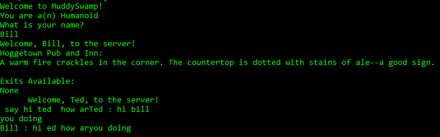
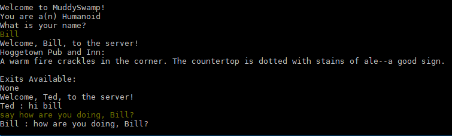

# SwampyMud

Multi-user dungeons, or "MUDs" are text-based role-playing games, that naturally evolved from the text-based rpg and adventure games of the 1970s.
This project aims to introduce a new generation—one that never experienced a world without broadband internet—to this classic game genre.
While this code can be adapted for any setting, we intend to render our university in beautiful ASCII. 

(Note: this project should be considered an alpha. Expect changes to the API.)

## Requirements

### Hosting
For **hosting** a server, Python 3 must be installed on the system (along with an appropriate internet connection.) For help with Python installation, visit <https://www.python.org>.

This project also requires the packages `websockets` (>= 8.1) and `PyYAML` (>=5.3.0).

### Connecting
For **connecting** to an existing server, a simple telnet client is required. However, we recommend using a dedicated MUD client to avoid ugliness like this:



There are many solid MUD clients available. 
We have been using [Mudlet](https://github.com/Mudlet/Mudlet), a completely free and open source MUD client.
Here's the same scenario, in Mudlet:



*You can now connect to a swampymud in your browser using a websocket. More on this later...*

## Getting Started
### Hosting

I recommend installing this package using `pip`:
```
pip3 install swampymud
```

Alternatively, if you want to install from source, you can clone this repo and install the requirements with `pip3 install -r requirements.txt`.

Either way, you can launch a Swampy MUD server right away like so:
```
python3 -m swampymud
```

By default, this will start a WebSocket server on port 9000.
If you want to specify a different port (e.g. 4000), you can run

```sh
python3 -m swampymud --ws 4000
```
To start a plain TCP server instead of a WebSocket server, use the `--tcp` flag.
```sh
python3 -m swampymud --tcp 8333
```
Why not both? You can provide both the `--ws` and `--tcp` arguments to start both a WebSocket server and a TCP server.
```sh
# this will start a WebSocket server on port 1234
# AND a plain TCP server on port 5678
python3 -m swampymud --ws 1234 --tcp 5678
```
For a full list of options, run `python3 -m swampymud --help`.

If you are hosting a server for other people to connect, you will need to port foward your router. When you port forward, select the TCP protocol and direct traffic towards whatever port the server is listening on. 

### Connecting

#### with a Raw Telnet Client

If you want to use an ugly, raw telent client, you can use the following terminal command on *nix systems:

```sh
# telnet <ip address> <port>
# if you started a server with the default settings:
telnet localhost 9000
```

On Windows, a telnet client is not provided by default. One option is to follow [this guide](http://technet.microsoft.com/en-us/library/cc771275%28v=ws.10%29.aspx)
to enable the Windows telnet client.

Alternatively, you can install [PuTTY](https://putty.org/), a **free and open source** telnet and ssh client. 

#### with Mudlet
1. Run Mudlet. You will be prompted to "Select a profile to connect with". 
2. You must enter a set of required fields:
    - For "Profile name", put whatever you prefer.
    - For "Server address", put the address of the server.
    - For "Port", put the port of the server.
3. Once all the fields are entered, simply press "connect". 
4. Have fun!
5. When you exit Mudlet, you will be asked if you want to save the profile. Select "Yes", and simply load the profile next time you play.

## Contributing
Please read **[CONTRIBUTING.md](CONTRIBUTING.md)** for how to work on the project.

## License
This project is licensed under the **MIT** License - see the [LICENSE.md](LICENSE.md) file for details.
